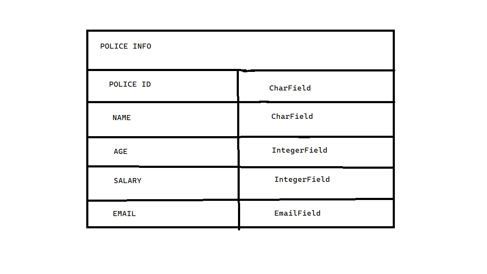
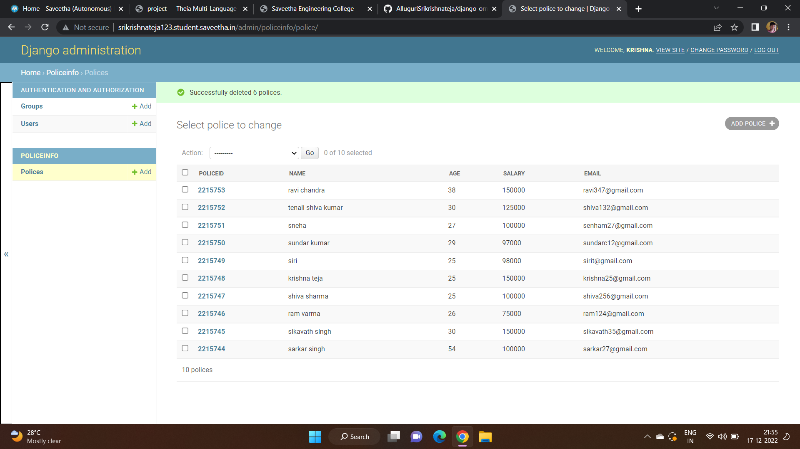
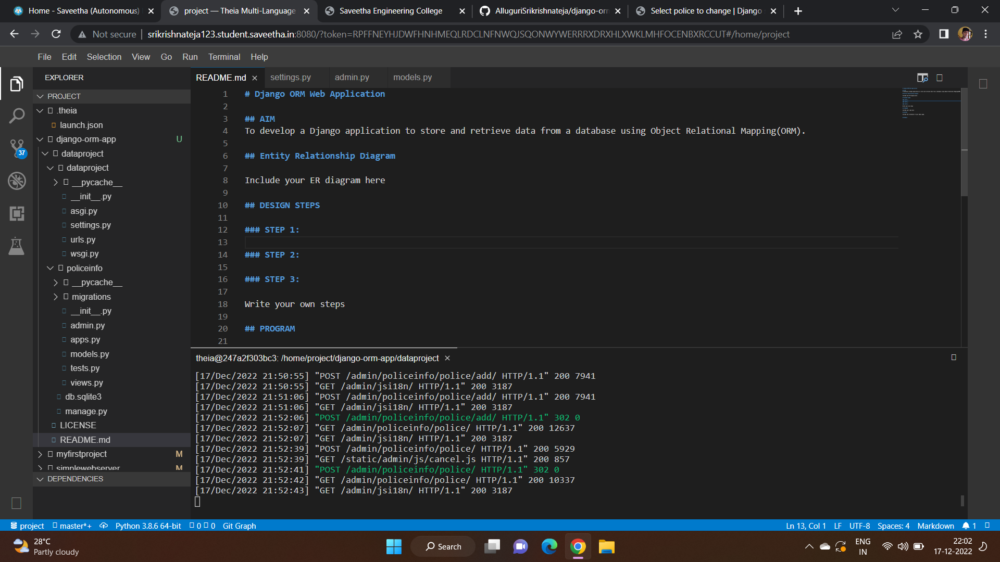

# Django ORM Web Application

## AIM
To develop a Django application to store and retrieve data from a database using Object Relational Mapping(ORM).

## Entity Relationship Diagram



## DESIGN STEPS

### STEP 1:
first we have to clone repository from git. Then we have to give a command to enter in "django-orm-app". Next we have to enter in the file called dataproject by using a command called "cd dataproject".
### STEP 2:
Now,we have to enter in our own created file named policeinfo by using the command called "python3 manage.py startapp policeinfo".
### STEP 3:
Now, we have to copy the thiea link and add admin and paste in new tab to get the output and enter the username and password 
and the details that we created in the terminal.
Write your own steps

## PROGRAM

```
from django.db import models
from django.contrib import admin
class Police(models.Model):
    policeid = models.CharField(max_length=8,primary_key=True)
    name = models.CharField(max_length=100)
    age = models.IntegerField()
    salary = models.IntegerField()
    email = models.EmailField()
# Create your models here.
class PoliceAdmin(admin.ModelAdmin):
    list_display = ('policeid','name','age','salary','email')
```

## OUTPUT





## RESULT
Successfully Executed.